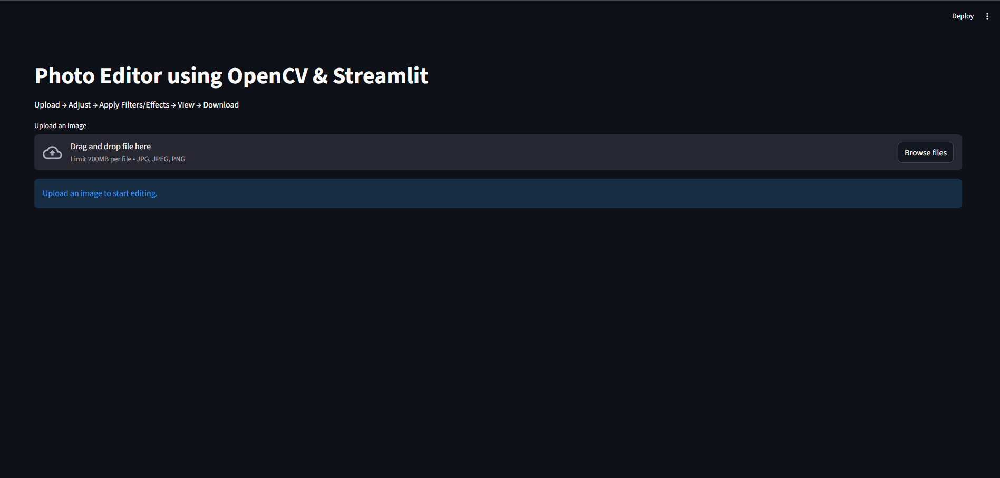
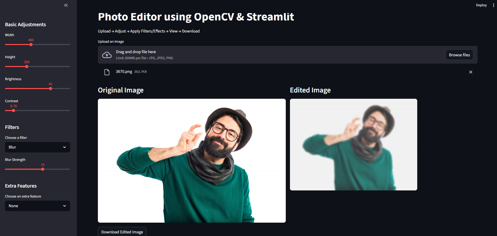
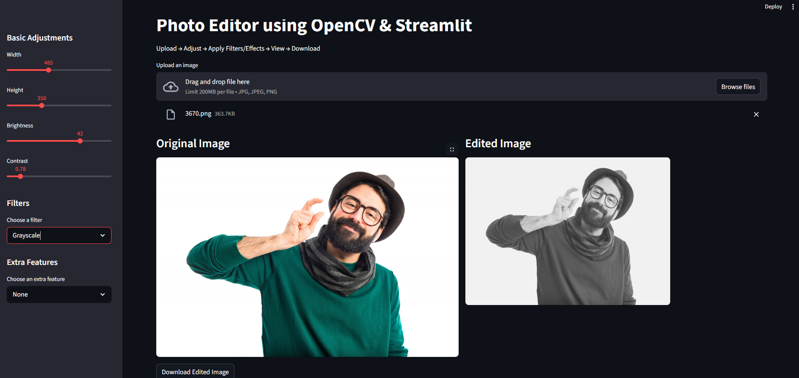
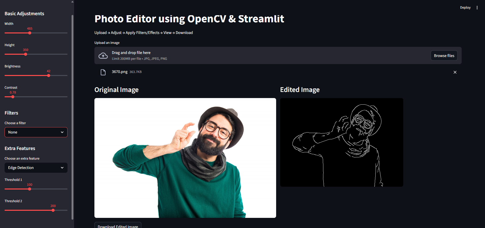
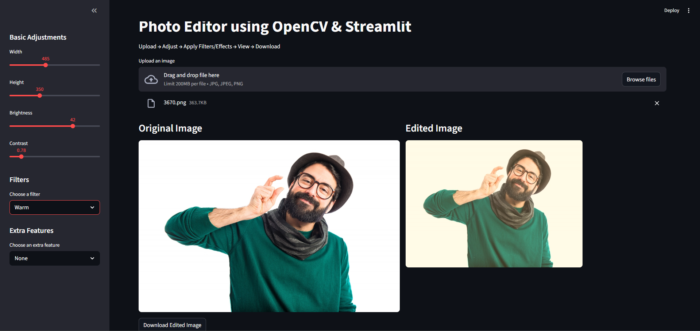
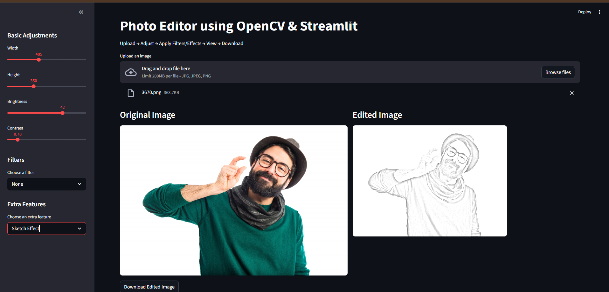
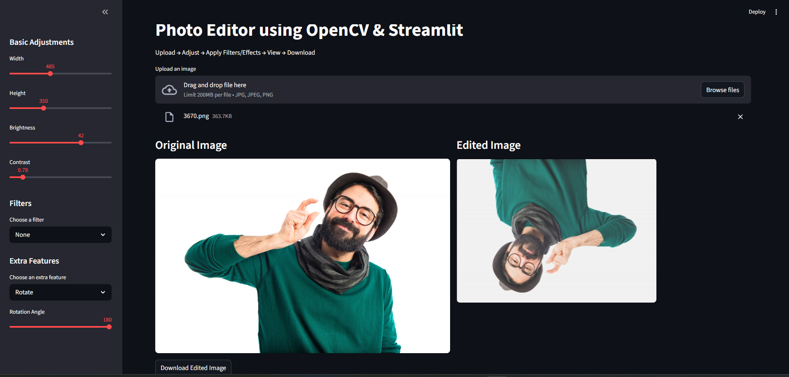
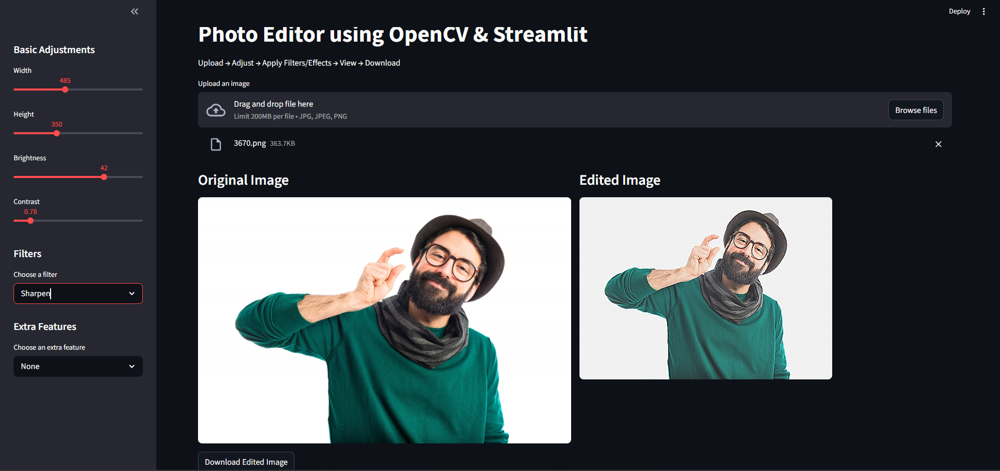

# 🖼️ Photo Editor using OpenCV & Streamlit

> A professional **image editing web application** built with **OpenCV** and **Streamlit** that allows users to upload images, apply adjustments, filters, and visual effects, and instantly download the edited output through an interactive interface.

---

## 📌 Overview

The **Photo Editor using OpenCV & Streamlit** is an interactive computer vision project designed to perform real-time image editing directly in the browser.

This application enables users to:

- Upload images easily  
- Adjust image dimensions and visual properties  
- Apply multiple filters such as **Blur, Grayscale, Warm, Sharpen, Portrait Blur**  
- Use extra effects like **Edge Detection, Rotate, Sketch Effect**  
- Preview original and edited images side by side  
- Download the final processed image instantly  

The project demonstrates practical implementation of **image processing techniques**, **OpenCV operations**, and **Streamlit-based UI development** in a beginner-friendly but professional format.

---

## ✨ Key Features

### 🎛️ Basic Adjustments
- Resize image using **width** and **height**
- Control **brightness**
- Adjust **contrast**

### 🎨 Filters
- **Blur**
- **Grayscale**
- **Warm**
- **Sharpen**
- **Portrait Blur**

### 🛠️ Extra Effects
- **Edge Detection**
- **Rotate**
- **Sketch Effect**

### 👀 Preview & Export
- Side-by-side display of:
  - **Original Image**
  - **Edited Image**
- One-click **Download Edited Image**

---

## 🚀 Workflow

The application follows a simple and user-friendly pipeline:

**Upload → Adjust → Apply Filters/Effects → Preview → Download**

This ensures smooth editing while allowing the user to visually compare the original and processed image before downloading.

---

## 🧠 Project Objective

The main goal of this project is to build a practical **photo editing application** using **computer vision concepts**.  
It helps in understanding how real-world image editors use operations such as:

- pixel manipulation
- filtering
- grayscale conversion
- edge extraction
- rotation
- blur effects
- contrast and brightness enhancement

This project is useful for learning both:

- **OpenCV for image processing**
- **Streamlit for deploying ML/CV projects as web apps**

---

## 🛠️ Tech Stack

- **Python**
- **OpenCV**
- **NumPy**
- **Pillow**
- **Streamlit**

---
## 📂 Project Structure

photo-editor/
│── app.py
│── requirements.txt
│── README.md
│── main.png
│── blur.png
│── grayscale.png
│── edge.png
│── warm.png
│── sketch.png
│── rotate.png
│── sharpen.png
│── original.png
│── output.png
## 📸 Screenshots

### 🖥️ Main Interface

### 🌫️ Blur Filter

### ⚫ Grayscale

### ✂️ Edge Detection

### 🌤️ Warm Filter

### ✏️ Sketch Effect

### 🔄 Rotate

### 🔍 Sharpen

## 📸 Application Screenshots

## 🖼️ Sample Input

## ✅ Downloaded Output

## 💡 Use Cases

This project can be used for:

- Learning **OpenCV image processing**
- Practicing **Streamlit app development**
- Building a **portfolio-ready computer vision project**
- Understanding how filters and effects work in image editing software

---

## 🔮 Future Enhancements

Possible improvements for the next version:

- Add **crop functionality**
- Add **flip and mirror effects**
- Add **text overlay**
- Add **multiple file upload**
- Add **real-time webcam editing**
- Add **before/after slider comparison**
- Add **advanced color correction tools**

---

## 📚 Learning Outcomes

Through this project, one can understand:

- How to read and process images in Python
- How OpenCV applies transformations and effects
- How to build an interactive UI using Streamlit
- How to deploy a computer vision project as a web application
- How image editing logic can be translated into a real-world product

---

## 🙌 Acknowledgment

This project was developed as a hands-on practice application to explore the integration of **OpenCV** with **Streamlit** for real-time image editing and visual enhancement.

---

## 📎 Conclusion

The **Photo Editor using OpenCV & Streamlit** is a practical and portfolio-worthy computer vision project that combines image processing with an interactive web-based user experience. It demonstrates how Python can be used not only for backend logic but also for building visually functional applications for end users.
